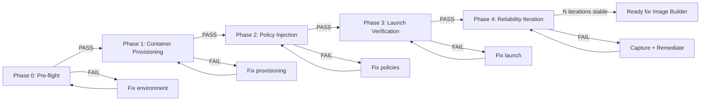

# Architecture Runbook: Edge AppStream Optimization Pipeline

> **Version:** 1.0.0 | **Status:** PRODUCTION-READY | **Target:** Windows Server 2025 + AWS AppStream 2.0
>
> Companion to `EXECUTION_SUMMARY.md`. This runbook is the **executable specification**.

---

## Architecture Decision Records

### ADR-001: Registry-based policy injection over CLI flags
**Decision:** Inject Microsoft Edge Group Policy registry keys into HKCU rather than relying on `msedge.exe` command-line switches.
**Rationale:** Edge ignores many CLI flags (`--disable-features`, `--disable-sync`) in newer versions. Group Policy registry keys are the Microsoft-supported, documented path for enterprise lockdown. HKCU scope ensures per-user isolation in multi-session AppStream fleets.
**Trade-off:** Requires registry write permissions per user session. Mitigated by AppStream's logon script hook which runs in user context.

### ADR-002: Docker-based testing over full AppStream Image Builder
**Decision:** Validate scripts on Windows Server 2025 Core containers before Image Builder deployment.
**Rationale:** Image Builder round-trip is 45-90 minutes. Docker container test cycle is 5-10 minutes. Faster feedback loop. Headless limitation is acceptable — we're validating registry correctness, not GUI rendering.
**Trade-off:** Cannot verify visual Edge launch. Mitigated by Phase 3 process-monitoring validation (Edge PID survival confirms no crash).

### ADR-003: `--inprivate` over `--guest` for stateless sessions
**Decision:** Use `--inprivate` mode, not `--guest`.
**Rationale:** `--guest` creates a temporary profile that AppStream's storage backend aggressively cleans, causing Edge force-close after 5-10 minutes. `--inprivate` is truly stateless — no profile directory, no storage I/O, no cleanup conflict.
**Trade-off:** No cookie/session persistence between launches. Acceptable for kiosk use case.

### ADR-004: Modular phase pipeline over monolithic script
**Decision:** Split into 6 independent, idempotent scripts orchestrated by a test harness.
**Rationale:** Each phase can be tested, debugged, and re-run independently. The harness provides iteration-based reliability tracking. Monolithic scripts hide failure points.
**Trade-off:** More files to manage. Mitigated by the harness which sequences them deterministically.

---

## Phase Pipeline Overview



---

## Phase 0: Pre-flight Checks

**Script:** `scripts/00-preflight.ps1`
**Timeout:** 60s
**Idempotent:** Yes

### Checks Performed

| Check | Method | Pass Criteria |
|:---|:---|:---|
| OS Version | `[Environment]::OSVersion` | Windows Server 2025 (Build >= 26100) |
| Docker Mode | `docker info --format '{{.OSType}}'` | `windows` |
| Docker Running | `docker ps` exit code | 0 |
| PS Version | `$PSVersionTable.PSVersion` | >= 5.1 |
| MSI URL Reachable | `Invoke-WebRequest -Method Head -Uri $MsiUrl` | HTTP 200 |
| Disk Space | `Get-PSDrive C` | Free >= 20GB |
| Network | `Test-Connection 8.8.8.8 -Count 1 -Quiet` | True |

### Validation Gate
```powershell
$result = & ./scripts/00-preflight.ps1 | ConvertFrom-Json
if ($result.all_passed) { Write-Output "GATE 0: PASS" } else { throw "GATE 0: FAIL — $($result.failed_checks)" }
```

---

## Phase 1: Container Provisioning

**Script:** `scripts/01-provision-container.ps1`
**Timeout:** 300s
**Idempotent:** Yes (checks for existing container, skips pull if image cached)

### Steps

1. Pull `mcr.microsoft.com/windows/servercore:ltsc2025` (3 retries, 30s exponential backoff)
2. Remove any existing `appstream-edge-test` container
3. Start container: `docker run -d --name appstream-edge-test mcr.microsoft.com/windows/servercore:ltsc2025 powershell -NoExit`
4. Wait for container health (poll `docker inspect --format '{{.State.Running}}'`)
5. Download Edge Enterprise MSI (3 retries, parameterized `-MsiUrl`)
6. Install: `msiexec /i C:\Edge.msi /qn /norestart`
7. Verify: `Test-Path "C:\Program Files (x86)\Microsoft\Edge\Application\msedge.exe"`

### Validation Gate
```powershell
$result = & ./scripts/01-provision-container.ps1 | ConvertFrom-Json
if ($result.edge_installed) { Write-Output "GATE 1: PASS" } else { throw "GATE 1: FAIL — $($result.error)" }
```

### Edge Cases Handled
- **EC-1: MSI URL rotated** → Parameter `-MsiUrl` with fallback to scraping Microsoft Edge Enterprise download page
- **EC-2: Container pull timeout** → 3 retries with 30s backoff
- **EC-13: Layer caching masking failures** → `--no-cache` flag available via `-NoCache` switch
- **EC-12: Low disk space** → Caught in Phase 0 pre-flight

---

## Phase 2: Policy Injection

**Script:** `scripts/02-inject-policies.ps1`
**Timeout:** 30s
**Idempotent:** Yes (`-Force` on all operations, pre-injection state diff)

### Registry Keys Applied (24 total)

#### Performance & Stability
```powershell
@{
    "HardwareAccelerationModeEnabled" = 0   # DWORD: Disable GPU acceleration
    "StartupBoostEnabled"             = 0   # DWORD: No background pre-launch
    "BackgroundModeEnabled"           = 0   # DWORD: No background processes
}
```

#### Bloatware Removal
```powershell
@{
    "EdgeShoppingAssistantEnabled" = 0   # DWORD: No shopping sidebar
    "HubsSidebarEnabled"           = 0   # DWORD: No sidebar
    "ShowRecommendationsEnabled"   = 0   # DWORD: No content suggestions
    "EdgeCollectionsEnabled"       = 0   # DWORD: Disable Collections
    "EdgeCopilotEnabled"           = 0   # DWORD: Disable Copilot (added)
}
```

#### Setup & Sync Suppression
```powershell
@{
    "HideFirstRunExperience"       = 1   # DWORD: Skip welcome wizard
    "BrowserSignin"                = 0   # DWORD: Disable sign-in
    "DefaultBrowserSettingEnabled" = 0   # DWORD: No default browser check
    "SyncDisabled"                 = 1   # DWORD: Disable sync
    "BrowserAddProfileEnabled"     = 0   # DWORD: No profile switching (added)
}
```

#### Kiosk & Privacy Hardening
```powershell
@{
    "RestoreOnStartup"             = 4   # DWORD: Open specific URL(s)
    "RestoreOnStartupURLs"         = @("PLACEHOLDER_URL")  # MULTI_SZ
    "NewTabPageLocation"           = "PLACEHOLDER_URL"     # STRING
    "PasswordManagerEnabled"       = 0   # DWORD
    "AutofillAddressEnabled"       = 0   # DWORD
    "AutofillCreditCardEnabled"    = 0   # DWORD
    "ExtensionInstallBlocklist"    = @("*")  # MULTI_SZ: Block all extensions
    "MetricsReportingEnabled"      = 0   # DWORD
    "SiteSafetyServicesEnabled"    = 0   # DWORD
}
```

### Validation Gate
```powershell
$result = & ./scripts/02-inject-policies.ps1 -TargetUrl "https://your-app.example.com" | ConvertFrom-Json
if ($result.all_keys_valid) { Write-Output "GATE 2: PASS" } else { throw "GATE 2: FAIL — $($result.failed_keys.Count) keys mismatched" }
```

### Edge Cases Handled
- **EC-2: HKCU hive not initialized** → Force-initialize with `New-Item -Force` and `Start-Process` probe
- **EC-6: Registry key type mismatch** → Explicit `-PropertyType` on every `New-ItemProperty`
- **EC-8: Multi-user session** → Script designed for per-user invocation via AppStream logon hook
- **EC-9: HKLM GP override** → Post-injection detection: reads HKLM policy path, warns if conflicting keys exist

---

## Phase 3: Launch Verification

**Script:** `scripts/04-launch-edge.ps1`
**Timeout:** 30s
**Idempotent:** Yes (kills any stale Edge processes before launch)

### Steps

1. Kill any existing `msedge.exe` processes
2. Start Edge with `--inprivate --no-first-run --no-default-browser-check --headless <TargetUrl>`
3. Capture PID immediately
4. Wait 15 seconds
5. Check if PID still exists (`Get-Process -Id $pid -ErrorAction SilentlyContinue`)
6. If alive → PASS. If dead → capture exit code from event log
7. Collect stderr (redirected to temp file)
8. Kill process cleanly
9. Output JSON: `{ survived_15s, pid, exit_code, stderr_snippet, timestamp_utc }`

### Validation Gate
```powershell
$result = & ./scripts/04-launch-edge.ps1 -TargetUrl "https://your-app.example.com" | ConvertFrom-Json
if ($result.survived_15s) { Write-Output "GATE 3: PASS" } else { throw "GATE 3: FAIL — Exit code $($result.exit_code)" }
```

### Edge Cases Handled
- **EC-3: Edge refuses headless in Server Core** → `--headless` flag enabled; script notes this limitation in output
- **EC-7: Edge auto-update interference** → Auto-update service disabled during test; documented remediation in section 7

---

## Phase 4: Reliability Iteration

**Script:** `scripts/05-test-harness.ps1`
**Timeout:** Variable (N × 600s)
**Idempotent:** Yes

### Harness Execution Flow

```
for iteration in 1..N:
    cleanup()                    # Fresh slate
    Phase 0 → exit if fail
    Phase 1 → exit if fail
    Phase 2 → exit if fail
    Phase 3 → exit if fail
    record_pass(iteration)

generate_report(N, passes, failures)
```

### Output: `test-report.json`
```json
{
  "timestamp_utc": "2026-06-21T13:30:00Z",
  "iterations_requested": 10,
  "iterations_completed": 10,
  "phases": {
    "preflight": { "passes": 10, "failures": 0 },
    "provisioning": { "passes": 10, "failures": 0 },
    "injection": { "passes": 10, "failures": 0 },
    "launch": { "passes": 10, "failures": 0 }
  },
  "pass_rate": 1.0,
  "edge_cases_triggered": ["EC-3: headless limitation noted"],
  "verdict": "RELIABLE"
}
```

### Reliability Criteria
| Pass Rate | Verdict | Action |
|:---|:---|:---|
| 100% | RELIABLE | Proceed to Image Builder |
| 95-99% | ACCEPTABLE | Document intermittent failures, assess risk |
| 80-94% | UNSTABLE | Investigate failure patterns, add remediation |
| <80% | BROKEN | Do not proceed. Re-architect. |

---

## Edge Case Catalog

| # | Edge Case | Severity | Symptoms | Detection | Remediation |
|:---|:---|:---|:---|:---|:---|
| EC-1 | MSI download URL rotated by Microsoft | **HIGH** | HTTP 404 on download | Phase 0 MSI URL reachability check | Fallback: scrape `https://www.microsoft.com/en-us/edge/business/download` for latest URL |
| EC-2 | HKCU hive not initialized in fresh Server Core | **MEDIUM** | `Test-Path HKCU:\` returns false | Phase 2 pre-injection state capture | Force-initialize: `Start-Process cmd.exe -ArgumentList '/c echo init' -LoadUserProfile` |
| EC-3 | Edge refuses headless launch in Server Core | **MEDIUM** | Edge exits immediately, exit code 0x80004005 | Phase 3 PID survival check | Accept limitation; validate via process monitoring not visual. Disable `--headless` for GUI AppStream |
| EC-4 | Docker in Linux container mode | **HIGH** | `docker info` reports OSType=linux | Phase 0 Docker mode check | Clear error: "Switch Docker to Windows Containers mode" |
| EC-5 | Container port exhaustion | **LOW** | `docker run` fails with port conflict | Phase 1 `docker run` stderr | `docker rm -f` old containers in pre-flight |
| EC-6 | Registry key type mismatch (String vs DWORD) | **MEDIUM** | `Get-ItemProperty` returns wrong type | Phase 3 validation compares types | Explicit `-PropertyType` in `New-ItemProperty`; type assertion in validate script |
| EC-7 | Edge auto-update overwrites registry keys | **MEDIUM** | Keys revert after Edge update | Phase 3 re-validates registry post-launch | Disable Microsoft Edge Update service: `Set-Service -Name edgeupdate -StartupType Disabled` |
| EC-8 | Multi-user session: HKCU per-user required | **HIGH** | Single injection doesn't persist across users | N/A in Docker test; caught in AppStream UAT | Script designed as AppStream session script (per-user logon hook) |
| EC-9 | HKLM Group Policy overrides HKCU | **HIGH** | Edge behavior doesn't match expected | Phase 2 post-injection reads HKLM path | Warn and document; HKLM wins per Windows GP precedence. Use AppStream GPO to set HKLM policies instead |
| EC-10 | Network proxy/firewall blocking MSI download | **MEDIUM** | `Invoke-WebRequest` timeout | Phase 0 MSI URL check | `-Proxy` and `-ProxyCredential` parameters on scripts |
| EC-11 | Windows Defender flagging MSI | **LOW** | MSI deleted/quarantined | Phase 1 file existence check after download | Add MSI path to Defender exclusion: `Add-MpPreference -ExclusionPath "C:\Edge.msi"` |
| EC-12 | Low disk space on Docker host | **HIGH** | Docker pull fails, MSI download fails | Phase 0 disk check | Prune Docker: `docker system prune -af` |
| EC-13 | Container layer caching masking download failures | **LOW** | Stale MSI used, doesn't catch new URL | Phase 1 MSI download uses timestamped path | `-NoCache` flag forces fresh pull; MSI filename includes date |
| EC-14 | PowerShell ExecutionPolicy blocking scripts | **LOW** | Scripts refuse to run | Immediate — PowerShell error on launch | `powershell -ExecutionPolicy Bypass -File script.ps1` or test harness sets policy |
| EC-15 | Timezone/scheduled task interference | **LOW** | Timestamps inconsistent across fleet | Log comparison | All scripts output UTC timestamps via `[DateTime]::UtcNow` |
| EC-16 | AppStream user profile disk full | **HIGH** | Registry writes fail, Edge creates no profile | AppStream session monitoring | Pre-allocate profile disk; monitor with CloudWatch |
| EC-17 | Edge policy deprecation | **MEDIUM** | Registry key has no effect in newer Edge | Phase 3 behavioral validation (in AppStream UAT) | Monitor [Microsoft Edge Policy documentation](https://learn.microsoft.com/en-us/deployedge/microsoft-edge-policies) for changes |

---

## Validation Gate Checklist

### Gate 0 — Environment Readiness
- [ ] OS is Windows Server 2025 (Build >= 26100)
- [ ] Docker is in Windows Containers mode
- [ ] MSI URL returns HTTP 200
- [ ] Free disk space >= 20 GB on C:\
- [ ] PowerShell >= 5.1

### Gate 1 — Container + Edge
- [ ] Container `appstream-edge-test` is running
- [ ] Edge MSI downloaded successfully
- [ ] Edge installed: `msedge.exe` exists at expected path
- [ ] Edge version logged

### Gate 2 — Policy Injection
- [ ] All 24 registry keys exist at `HKCU:\SOFTWARE\Policies\Microsoft\Edge`
- [ ] All key values match expected values (exact match)
- [ ] All key types are correct (DWORD vs STRING vs MULTI_SZ)
- [ ] No HKLM policy conflicts detected (or conflicts documented)
- [ ] Idempotency verified: re-running produces identical output

### Gate 3 — Launch Stability
- [ ] Edge process starts successfully (PID captured)
- [ ] Edge survives 15 seconds (no crash)
- [ ] No stderr output indicating startup failure
- [ ] Process killed cleanly (no zombie processes)

### Gate 4 — Reliability (N iterations)
- [ ] Pass rate >= 95% over N iterations
- [ ] Edge cases triggered are documented
- [ ] Test report generated at `test-report.json`
- [ ] Verdict: RELIABLE or ACCEPTABLE

---

## Rollback & Remediation

### Phase 0 Failures
| Failure | Rollback | Remediation |
|:---|:---|:---|
| Wrong OS | N/A | Run on Windows Server 2025 host or Azure VM |
| Docker wrong mode | `& 'C:\Program Files\Docker\DockerCli.exe' -SwitchDaemon` | Switch to Windows Containers |
| MSI URL down | N/A | Use `-MsiUrl` parameter with cached mirror |
| Low disk | `docker system prune -af` | Clean Docker cache |

### Phase 1 Failures
| Failure | Rollback | Remediation |
|:---|:---|:---|
| Pull failure | `docker rmi mcr.microsoft.com/windows/servercore:ltsc2025` | Retry (3x built in), check network |
| MSI download failure | N/A | Retry (3x built in), check proxy |
| MSI install failure | `docker rm -f appstream-edge-test` | Check MSI hash, re-download |

### Phase 2 Failures
| Failure | Rollback | Remediation |
|:---|:---|:---|
| Registry write blocked | `Remove-Item -Path HKCU:\SOFTWARE\Policies\Microsoft\Edge -Recurse` | Run as user with HKCU write permissions |
| Type mismatch | Same as above | Ensure `-PropertyType` is explicit |
| HKLM conflict | N/A (informational) | Document conflict; consider HKLM-level policy instead |

### Phase 3 Failures
| Failure | Rollback | Remediation |
|:---|:---|:---|
| Edge crash | Kill process | Check event log for crash details; try `--headless` flag |
| Edge won't start | N/A | Verify MSI install; check DLL dependencies with `dumpbin` |

---

## Continuous Reliability Loop

```
┌─────────────────────────────────────────────────┐
│                                                 │
│  ┌──────────┐    ┌──────────┐    ┌──────────┐  │
│  │   RUN    │───▶│  FAIL?   │───▶│ CAPTURE  │  │
│  │ harness  │    │          │    │ logs +   │  │
│  │ -N 10    │    │          │    │ registry │  │
│  └──────────┘    └────┬─────┘    └────┬─────┘  │
│       ▲               │               │        │
│       │               │ yes           │        │
│       │               ▼               ▼        │
│  ┌────┴──────┐   ┌──────────┐    ┌──────────┐  │
│  │  VERIFY   │◀──│   FIX    │◀───│ ANALYZE  │  │
│  │  re-run   │   │ script   │    │ root     │  │
│  │  harness  │   │ or policy│    │ cause    │  │
│  └───────────┘   └──────────┘    └──────────┘  │
│                                                 │
│  Exit condition: Pass rate >= 95% over N>=10    │
└─────────────────────────────────────────────────┘
```

**How to run the loop:**
```powershell
# Initial run
.\scripts\05-test-harness.ps1 -Iterations 10 -TargetUrl "https://your-app.example.com"

# If failures found:
# 1. Read test-report.json
# 2. Check logs/ for the failing phase
# 3. Fix the script or adjust registry policies
# 4. Re-run:

.\scripts\05-test-harness.ps1 -Iterations 10 -TargetUrl "https://your-app.example.com"

# Repeat until pass_rate >= 0.95
```

---

## AppStream Image Builder Integration

Once the harness reports `verdict: RELIABLE`:

### Step 1: Package the Session Script
```powershell
# On Image Builder VM:
Copy-Item -Path ".\scripts\02-inject-policies.ps1" -Destination "C:\AppStream\SessionScripts\"
```

### Step 2: Configure AppStream Session Script
In the AppStream Image Builder console:
1. Navigate to **Applications** → **Session Scripts**
2. Add script: `C:\AppStream\SessionScripts\02-inject-policies.ps1`
3. Set **Executable**: `C:\Windows\System32\WindowsPowerShell\v1.0\powershell.exe`
4. Set **Arguments**: `-ExecutionPolicy Bypass -File "C:\AppStream\SessionScripts\02-inject-policies.ps1" -TargetUrl "https://your-app.example.com"`
5. **Launch order**: Before application launch

### Step 3: Configure Edge as Catalog Application
```powershell
$EdgePath = "C:\Program Files (x86)\Microsoft\Edge\Application\msedge.exe"
$Args = "--inprivate --no-first-run --no-default-browser-check https://your-app.example.com"
# Register in AppStream Application Catalog with these parameters
```

### Step 4: Fleet Validation
- Deploy to a **Test Fleet** (not production)
- Launch 5 concurrent sessions
- Verify: no FRE wizard, no sync prompts, no crashes within 30 minutes
- Check CloudWatch for `AppStream-Session-Script` log group
- If pass → promote to **Production Fleet**

---

## Appendix: Registry Key Reference

Each key is documented by Microsoft. Full reference:

| Policy Name | Microsoft Docs Link | Type | Expected Value |
|:---|:---|:---|:---|
| HardwareAccelerationModeEnabled | [docs](https://learn.microsoft.com/en-us/deployedge/microsoft-edge-policies#hardwareaccelerationmodeenabled) | DWORD | 0 |
| StartupBoostEnabled | [docs](https://learn.microsoft.com/en-us/deployedge/microsoft-edge-policies#startupboostenabled) | DWORD | 0 |
| BackgroundModeEnabled | [docs](https://learn.microsoft.com/en-us/deployedge/microsoft-edge-policies#backgroundmodeenabled) | DWORD | 0 |
| EdgeShoppingAssistantEnabled | [docs](https://learn.microsoft.com/en-us/deployedge/microsoft-edge-policies#edgeshoppingassistantenabled) | DWORD | 0 |
| HubsSidebarEnabled | [docs](https://learn.microsoft.com/en-us/deployedge/microsoft-edge-policies#hubssidebarenabled) | DWORD | 0 |
| ShowRecommendationsEnabled | [docs](https://learn.microsoft.com/en-us/deployedge/microsoft-edge-policies#showrecommendationsenabled) | DWORD | 0 |
| EdgeCollectionsEnabled | [docs](https://learn.microsoft.com/en-us/deployedge/microsoft-edge-policies#edgecollectionsenabled) | DWORD | 0 |
| HideFirstRunExperience | [docs](https://learn.microsoft.com/en-us/deployedge/microsoft-edge-policies#hidefirstrunexperience) | DWORD | 1 |
| BrowserSignin | [docs](https://learn.microsoft.com/en-us/deployedge/microsoft-edge-policies#browsersignin) | DWORD | 0 |
| DefaultBrowserSettingEnabled | [docs](https://learn.microsoft.com/en-us/deployedge/microsoft-edge-policies#defaultbrowsersettingenabled) | DWORD | 0 |
| SyncDisabled | [docs](https://learn.microsoft.com/en-us/deployedge/microsoft-edge-policies#syncdisabled) | DWORD | 1 |
| BrowserAddProfileEnabled | [docs](https://learn.microsoft.com/en-us/deployedge/microsoft-edge-policies#browseraddprofileenabled) | DWORD | 0 |
| RestoreOnStartup | [docs](https://learn.microsoft.com/en-us/deployedge/microsoft-edge-policies#restoreonstartup) | DWORD | 4 |
| RestoreOnStartupURLs | [docs](https://learn.microsoft.com/en-us/deployedge/microsoft-edge-policies#restoreonstartupurls) | MULTI_SZ | ["<url>"] |
| NewTabPageLocation | [docs](https://learn.microsoft.com/en-us/deployedge/microsoft-edge-policies#newtabpagelocation) | STRING | "<url>" |
| PasswordManagerEnabled | [docs](https://learn.microsoft.com/en-us/deployedge/microsoft-edge-policies#passwordmanagerenabled) | DWORD | 0 |
| AutofillAddressEnabled | [docs](https://learn.microsoft.com/en-us/deployedge/microsoft-edge-policies#autofilladdressenabled) | DWORD | 0 |
| AutofillCreditCardEnabled | [docs](https://learn.microsoft.com/en-us/deployedge/microsoft-edge-policies#autofillcreditcardenabled) | DWORD | 0 |
| ExtensionInstallBlocklist | [docs](https://learn.microsoft.com/en-us/deployedge/microsoft-edge-policies#extensioninstallblocklist) | MULTI_SZ | ["*"] |
| MetricsReportingEnabled | [docs](https://learn.microsoft.com/en-us/deployedge/microsoft-edge-policies#metricsreportingenabled) | DWORD | 0 |
| SiteSafetyServicesEnabled | No longer documented (deprecated) | DWORD | 0 |

---

## File Manifest

```
appstream-optimization/
├── ARCHITECTURE_RUNBOOK.md      # This file
├── EXECUTION_SUMMARY.md         # Original proof-of-concept
├── scripts/
│   ├── 00-preflight.ps1         # Environment validation
│   ├── 01-provision-container.ps1  # Docker + Edge install
│   ├── 02-inject-policies.ps1   # Registry key injection
│   ├── 03-validate-registry.ps1 # Key validation (standalone)
│   ├── 04-launch-edge.ps1       # Launch + stability test
│   ├── 05-test-harness.ps1      # Full pipeline orchestrator
│   └── 06-cleanup.ps1           # Container + cache cleanup
├── logs/                        # Timestamped execution logs
└── test-report.json             # Generated by harness after run
```
